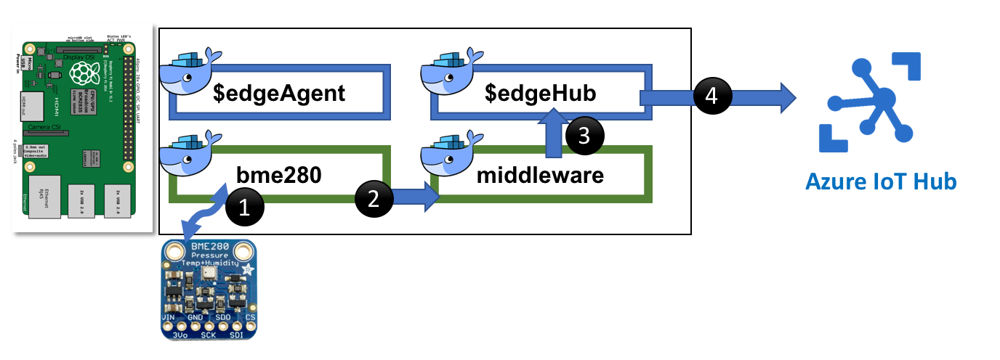
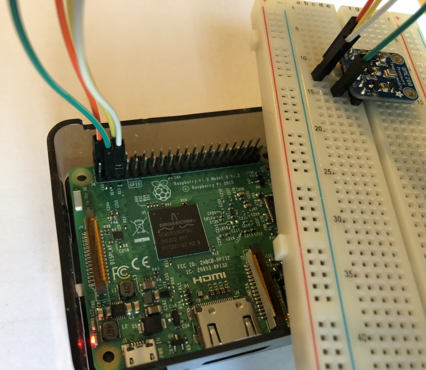

# Introduction

[Microsoft Windows 10 IoT Core Starter Pack](https://developer.microsoft.com/en-us/windows/iot/Docs/AdafruitMakerKit.htm)  is a great way to start exploring the IoT world. It comes with a Raspberry PI 3 a BME208 Temperature/Humidity/Pressure sensor and other cool pieces.

With [Azure IoT Edge](https://docs.microsoft.com/en-us/azure/iot-edge/) we are able to install software from a portal (IoT Hub) to connected devices (edge). The aim of this project is to implement and deploy the sensor reader to a Raspberry PI as an Azure IoT Edge Module.

This repository creates 2 IoT Edge modules that communicate between them like the diagram below:

1. bme280 module reads data from sensor and sents to output channel
2. middleware module receives data from sensor (sent by $edgeHub) and sents to his output channel
3. $edgeHub sends the output of middleware module to IoT Hub (as it was binded to $upstream)

# Hardware needed

To get started you need the kit mentioned Windows 10 IoT Core Started Pack, or the following components:

- Raspberry PI 3 (2 should also work)
- Assembled [Adafruit BME280 I2C Sensor](https://www.adafruit.com/product/2652)
- Breadboard
- MicroSB Memory Card
- Female/Male Jumper Wires

# Getting Started

A lot of the steps will refer to content from Jon Gallant. You should follow his [blog](https://blog.jongallant.com/).

1. [Setup Raspberry Pi](https://blog.jongallant.com/2017/11/raspberrypi-setup/)
2. [Setup Raspberry Pi for Azure IoT Edge](https://blog.jongallant.com/2017/11/azure-iot-edge-raspberrypi/)
3. [Connect Raspberry Pi with Azure IoT Hub](https://docs.microsoft.com/en-us/azure/iot-edge/tutorial-simulate-device-Linux)

# Connecting Rapberry Pi to BME208 Sensor
Refer to this [document](https://microsoft.hackster.io/en-US/windows-iot/weather-station-67e40d) to connect Pi with the sensor.

# Developing IoT Edge module in C#

Being familiar with C# my first choice was to use .NET Core to develop the IoT Edge module. The problem I faced was finding a way to talk to the sensor in .NET Core. Most examples were using Windows IoT and I wanted to use a Linux OS. However, Adafruit (manufacturer of the sensor) provides good examples using Python. Being lazy, I wanted to call the python code from my C# module. Check the (repository)[src/cs/] to understand how.

# Developing IoT Edge module in Python
To be implemented
